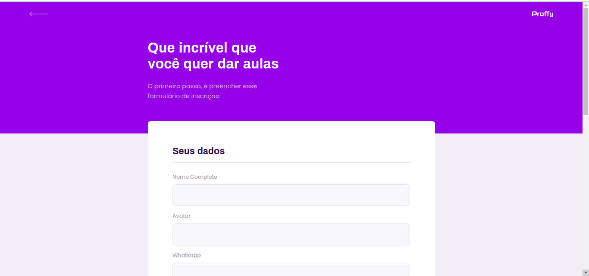
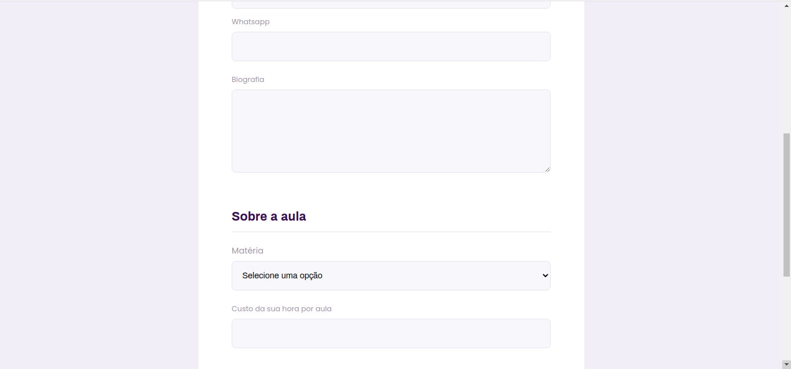
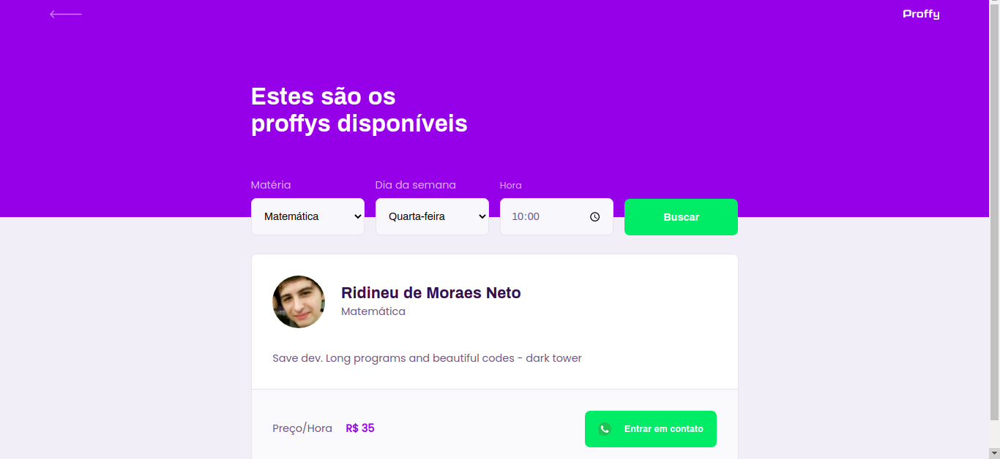

<strong>Proffy</strong> - Aplicação web desenvolvida na next-level-week-2 da rocketseat. 

- Para rodar o projeto, 

Primeiro, já com o <a target="_blank" href="https://github.com/ridneto/nlw2-back"> backend </a> do projeto instalado, siga os passos ->

```bash
# Clone este repositório
$ git clone git@github.com:ridneto/nlw2-web.git

# Acesse a pasta do projeto no terminal/cmd
$ cd nlw2-web

# Instale as dependências
$ yarn install

# Execute a aplicação a aplicação
$ yarn start
```

Tela principal 


Tela cadastro de aulas





Tela consulta aulas/professores


